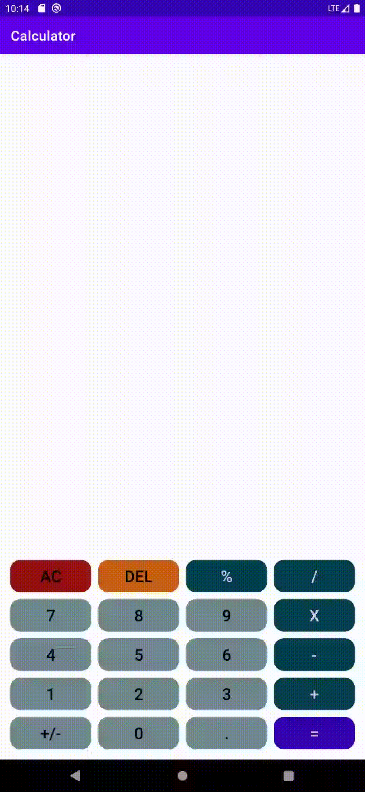
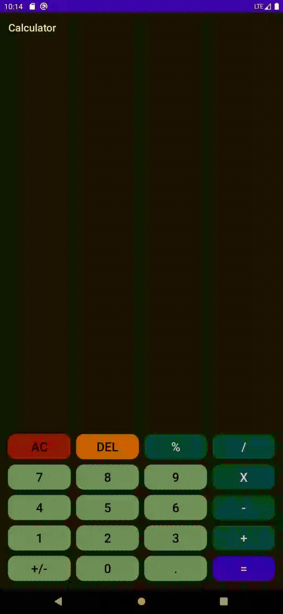



  

# Description
**Calculator** is application for devices with Android operating system, which allows to calculate mathematical expressions. 
Calculator also remembers every done calculation - there is History menu to view historical calculations, restore chosen, delete chosen or delete all. 
It also has advanced mode - after enabling it by clicking button on app bar option menu, it is possible to use buttons like open and close parentheses, power of number, or square root (any many more features in future).

# Install
Download and install Calculator_*.apk file from **Releases** section (*install from unknown sources* option must be enabled in settings of Android system).

# Demo
 &emsp; 
